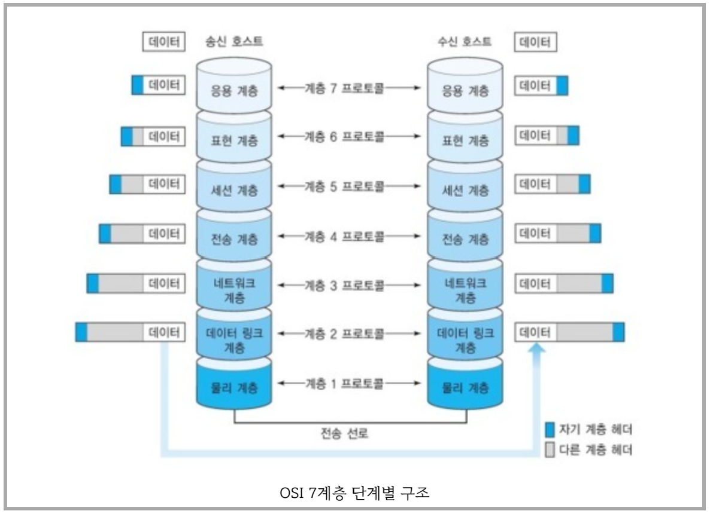

# OSI-7Layer

각 계층 별로 캡슐화하여 인코딩 시에는 높은 계층에서 낮은 계층순으로 진행하고
디코딩 시에는 낮은 계층에서 높은 계층 순으로 진행 된다.  

---

## 7계층 어플리케이션 레이어 (Application Layer)
* 
* TCP/IP 소켓 프로그래밍
	- 네트워크 프로그래밍 이라고도 불림.
	- 4계층에 운영체제에서 제공하는 API를 활용해서 통신 가능한 프로그래밍을 만드는 것.
	- 소켓을 통해 누구나 자신만의 Application Layer 인코더와 디코더를 만들 수 있음.

  
---

## 6계층 프레젠테이션 레이어 (Presentaion Layer)

---

## 5계층 세션 레이어 (Session Layer)

---

## 4계층 트랜스포트 레이어 (Transport Layer)
* Port 번호를 사용하여 도착지 컴퓨터의 최종 프로세스까지 도달하게 해주는 모듈이다
* 운영체제 커널에 소프트웨어적으로 구현되어있다.
  
---

## 3계층 네트워크 레이어 (Network Layer)

* 수많은 네트워크들의 연결로 이루어지는 inter-network속에서 어딘가에 있는 목적지 컴퓨터로 데이터를 전송하기 위해
* IP주소를 이용하여 길을 찾고(라우팅)
* 자신 다음의 라우터에게 데이터를 넘겨주는것(포워딩)
* 운영체제 <u>커널</u>에 소프트웨어적으로 구현되어있다.
	+ 커널이란?
		- 운영체제의 핵심이 되는 컴퓨터 프로그램이다.
		- 시스템의 모든것을 완전히 제어한다.
		- 보안 : 하드웨어와 프로세스의 보안을 책임진다.
		- 자원관리 : 시스템 자원을 효율적으로 관리하여 프로그램의 실행을 원할하게 한다. 프로세스에 처리기를 할당 하는것을 스케쥴링이라고 한다.
		- 추상화 : 소프트웨어와 하드웨어 사이에서 일관성 있는 인터페이스를 하드웨어에게 제공 하기 위해 하드웨어 추상화를 사용하는데 이 때 소프트웨어 드라이버를 의지한다.

---

## 2계층 데이터 링크 레이어 (DataLink Layer)

* 같은 네트워크에 있는 여러대의 컴퓨터들이 데이터를 주고 받기 위해 필요한 모듈
* Framing 이란 통신을 위해 앞뒤에 데이터를 감싸는것.
* 1계층 처럼 `하드웨어`적으로 `랜카드`에 구현되어있음

---

## 1계층 피지컬 레이어 (Physical Layer)

* `아날로그 신호`로 정보를 주고 받을 수 있는것.
* 피지컬 레이어는 `하드웨어`적으로 PHY 칩에 구현 되어있음.

소프트웨어 아키텍처에는 MVC 패턴, 레이어드 아키텍처 등이 있고,
네트워크 시스템은 레이어드 아키텍처에 속해 있으므로
네트워크 시스템은 큰 소프트웨어 이다.

  
ps. 레이어 공부시 좋은 영상 (10분 테코톡)
https://www.youtube.com/watch?v=1pfTxp25MA8&ab_channel=%EC%9A%B0%EC%95%84%ED%95%9C%ED%85%8C%ED%81%AC

